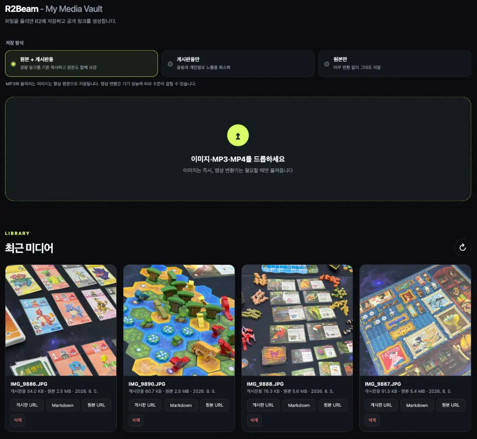

# R2Beam

> Upload once. Beam it anywhere.

[](https://r2beam.xguru.net/)

R2Beam은 자신의 Cloudflare 계정에 설치하는 개인 미디어 저장소입니다.
이미지와 영상을 브라우저에서 게시판용으로 가볍게 변환하고, Cloudflare R2에 저장한 뒤
어디서나 사용할 수 있는 공개 링크를 만들어줍니다.



- 관리자 화면과 API는 Cloudflare Access 로그인으로 보호
- 생성된 `/media/*` 링크만 공개
- 원본만 / 최적화본만 / 둘 다 보관 선택
- 이미지: WebP 품질 78, 긴 변 960px, 확대·크롭 없음, 방향 반영 및 메타데이터 제거
- 영상: H.264 MP4, 긴 변 960px, 최대 30fps, CRF 29, AAC 96kbps, Fast Start
- 영상 재생을 위한 HTTP Range 요청 지원

## 설치

설치 전에 Cloudflare Dashboard의 **Storage & databases → R2 → Overview**에서
R2 구독을 활성화해야 합니다. R2에는 무료 월간 사용량이 포함되지만 새 계정은 최초
한 번 체크아웃을 완료해야 합니다. [R2 활성화 화면](https://dash.cloudflare.com/?to=%2F%3Aaccount%2Fr2%2Foverview)
에서 진행할 수 있습니다.

1. 위의 **Install R2Beam** 버튼을 눌러 설치 도우미를 실행합니다.
2. Cloudflare에 로그인하고 설치할 계정과 요청 권한을 확인합니다.
3. 필요하면 자신의 Cloudflare Zone에 속한 커스텀 도메인을 입력합니다.
4. 설치기가 R2 비활성 상태를 안내하면 Dashboard에서 활성화한 뒤 **활성화했습니다 · 다시 시도**를 누릅니다.
5. 설치가 끝나면 **내 미디어 볼트 열기**를 누릅니다.

별도 서버 없이 Cloudflare 계정과 활성화된 R2 구독만 있으면 됩니다. Account ID,
API Token, Google·GitHub OAuth 설정을 따로 준비할 필요가 없습니다. 설치 도우미가
다음 항목을 자동으로 구성합니다.

- 미디어를 저장할 전용 R2 버킷과 Worker 생성
- 설치한 계정만 들어올 수 있는 Cloudflare Access 로그인 구성
- 선택한 커스텀 도메인의 DNS, 인증서와 Access 정책 구성
- 파일 업로드 기능과 게시판·블로그에서 바로 쓸 수 있는 공개 미디어 링크 페이지 구성
- 트래픽 최소화를 위한 이미지 최적화 및 FFmpeg을 이용한 동영상 인코딩 기능 제공

사용자는 Cloudflare 로그인, 계정 선택, 권한 승인, 설치 버튼만 진행하면 됩니다.
이미 로그인 방식이 있는 계정은 기존 설정을 유지하고, 아무것도 설정하지 않은
계정에는 Cloudflare 계정 로그인을 자동으로 추가합니다. OAuth 접근 권한은 설치
완료 직후 폐기되며 설치 도우미는 R2Beam 설치에만 사용됩니다.

R2가 아직 활성화되지 않은 계정에서 Cloudflare 오류 `10042`가 반환되면 설치기는
원문 오류 대신 활성화 안내를 표시합니다. R2를 활성화한 뒤 같은 화면에서 재시도하면
기존 OAuth 설치 세션과 입력값을 유지한 채 R2 버킷 준비 단계부터 다시 진행합니다.

커스텀 도메인은 선택 사항입니다. 비워두면 `<worker>.<account>.workers.dev` 주소를
사용합니다. 입력한 도메인의 활성 Cloudflare Zone이 설치 대상 계정에 있어야 하며,
예를 들어 `example.com` Zone이 있다면 `vault.example.com`을 입력할 수 있습니다.

## 중앙 설치기

`https://r2beam.xguru.net`에서 동작하는 중앙 설치기 소스도 이 저장소의
[`installer/`](installer/) 폴더에 포함되어 있습니다. 일반 사용자는 운영 중인 중앙
설치기를 이용하면 되고, 독립적인 설치 서비스를 원하는 운영자는 같은 코드를 자신의
Cloudflare 계정에 배포할 수 있습니다.

중앙 설치기는 설치할 때만 사용됩니다. 설치 이후의 관리자 로그인, 파일 업로드,
미디어 저장 및 공개 전송은 모두 사용자의 Worker와 R2에서 직접 처리되므로 중앙
설치기의 운영 상태와 무관하게 동작합니다. 자세한 구조와 자체 호스팅 설정은
[`docs/one-click-installer.md`](docs/one-click-installer.md)를 참고하세요. Cloudflare
Access의 생성 항목과 로그인 구조는
[`docs/cloudflare-access.md`](docs/cloudflare-access.md)에 정리되어 있습니다.

## 로컬 개발

```bash
npm install
cp .dev.vars.local.example .dev.vars
npm run dev
```

`DEV_AUTH_BYPASS=true`는 `localhost`, `127.0.0.1`, `[::1]`에서만
작동합니다. 다른 호스트에서는 이 값이 있어도 Access JWT가 반드시 필요합니다.
로컬 R2 데이터는 Wrangler의 로컬 저장소에만 보관됩니다.

```bash
npm test       # Access JWT와 미디어 순수 함수 테스트
npm run build  # ffmpeg.wasm 브라우저 자산 생성
npm run check  # 테스트 + 빌드 + Worker dry-run
npm run installer:check # 중앙 설치기 테스트 + 릴리스 빌드 + dry-run
```

## 공개 링크와 보안 경계

| 경로 | 공개 여부 | 용도 |
| --- | --- | --- |
| `/`, `/index.html` | 비공개 | 업로더와 미디어 라이브러리 |
| `/api/media/*` | 비공개 | 업로드, 목록, 삭제 |
| `/media/*` | 공개 | 게시판·블로그에 삽입하는 영구 미디어 |

공개 링크를 아는 사람은 해당 파일을 볼 수 있습니다. 삭제하면 외부에 삽입한
링크도 깨집니다. Worker는 Access가 앞단에서 인증하더라도
`Cf-Access-Jwt-Assertion`의 RS256 서명, issuer, audience와 만료 시간을 다시
검증합니다. `TEAM_DOMAIN`과 `POLICY_AUD`는 저장소에 직접 넣지 않습니다.
중앙 설치기의 OAuth 접근 권한은 설치가 끝나면 즉시 폐기합니다.

## 저장 비용

R2의 인터넷 egress는 무료지만 저장 용량과 Class A/B 작업은 요금 및 무료
한도의 적용을 받습니다. Cloudflare의 최신 R2 가격과 계정 알림을 확인하세요.
R2Beam 자체에는 월 예산 초과 시 자동으로 업로드를 차단하는 기능이 아직
없습니다.

## 라이선스

R2Beam 소스는 [MIT](LICENSE) 라이선스입니다. 빌드에 포함되는
`@ffmpeg/core`는 GPL-2.0-or-later이므로 배포·재배포 시
[THIRD_PARTY_NOTICES.md](THIRD_PARTY_NOTICES.md)도 확인하세요.
